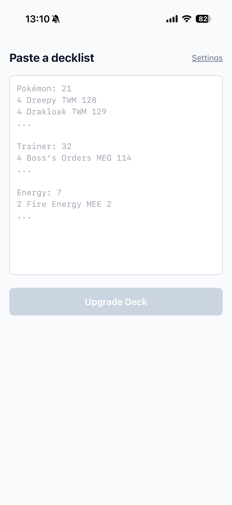
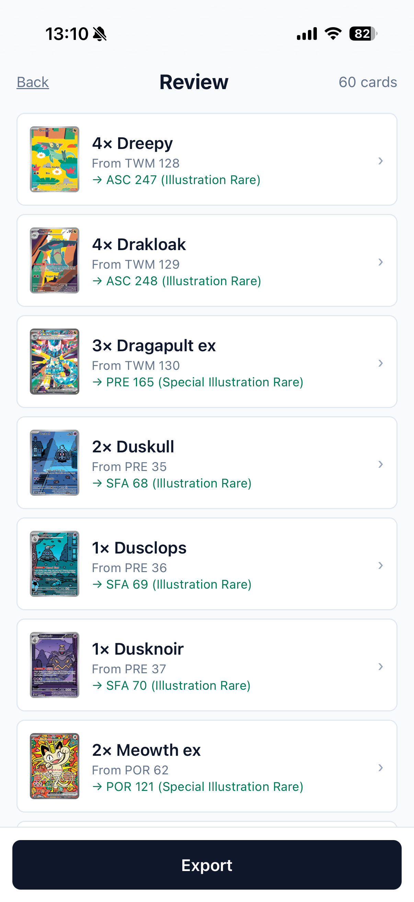
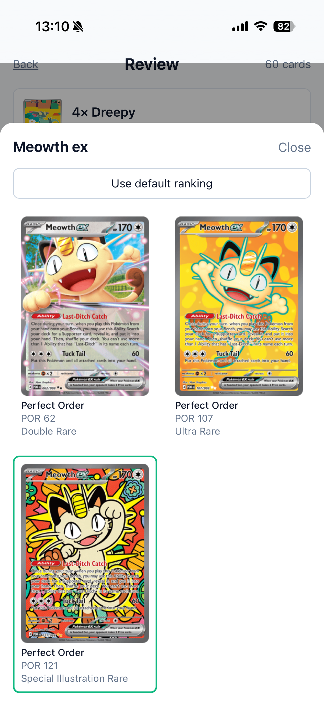

# Pokémon TCG Live Deck Blinger

**Live demo: [pokemon-tcg-live-deck-blinger.vercel.app](https://pokemon-tcg-live-deck-blinger.vercel.app/)**

Mobile-first React app that upgrades the printings in a Pokémon TCG Live decklist to their rarest available versions — alt arts, secret rares, gold and full-art prints — while keeping the deck importable back into TCG Live.

Paste your decklist, get back the same deck with every card swapped to its blingiest legal printing. Per-card overrides, persistent preferences, share-link export. No sign-up, no backend, no ads.

## Screenshots

<p align="center">
  
  &nbsp;
  
  &nbsp;
  
</p>

## How it works

1. Paste a decklist in standard TCG Live format.
2. The app fetches every printing of every card from [pokemontcg.io](https://pokemontcg.io) and ranks them by rarity (configurable in Settings).
3. For Pokémon, only printings with identical attacks/abilities/HP are offered as swaps — same-name lookalikes with different stats are filtered out automatically.
4. Review and override per-card choices; locked choices persist in `localStorage`.
5. Copy the upgraded decklist back into TCG Live or share via URL.

Card data is cached in IndexedDB for 30 days. Share links encode the deck in the URL fragment — no backend needed.

## Develop

```bash
npm install
npm run dev
```

Requires Node 20.19+ or 22.12+ (Vite 8 dependency). `.nvmrc` pins to 22.

## Test

```bash
npm test          # unit + integration (Vitest)
npm run test:e2e  # Playwright mobile-Chrome happy-path
```

## Build

```bash
npm run build
npm run preview
```

## Tech

React + Vite + TypeScript + Tailwind. Vitest + Playwright. No backend; deployed as a static SPA on Vercel.
